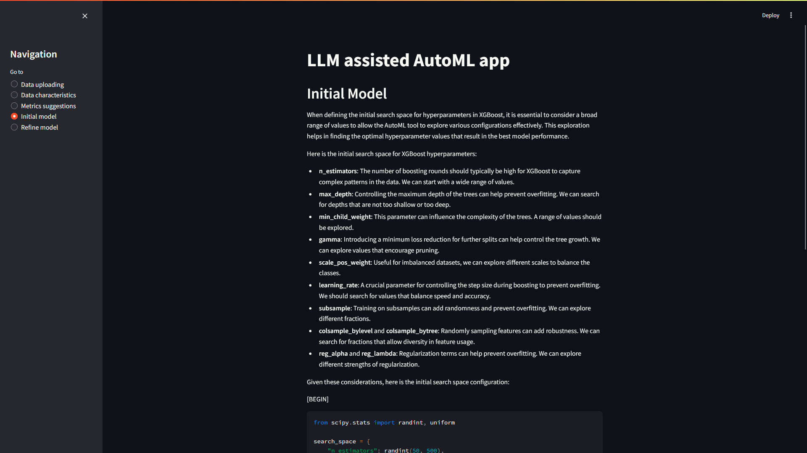
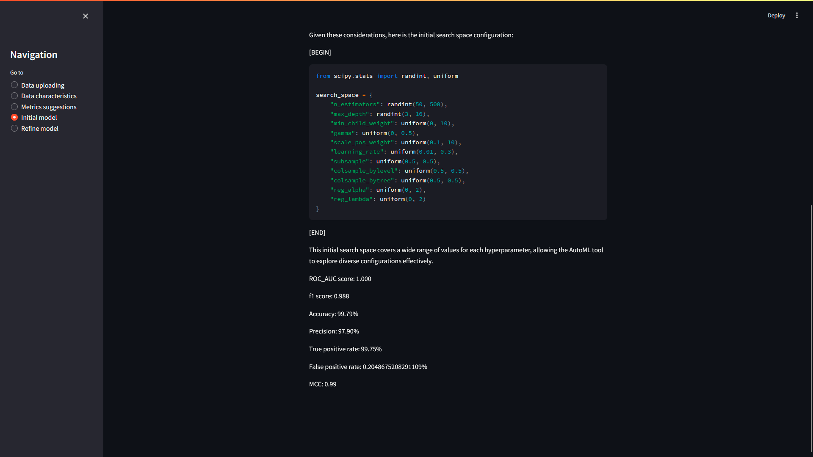
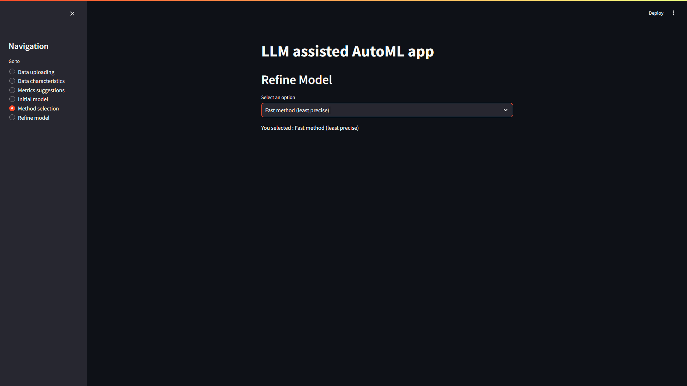
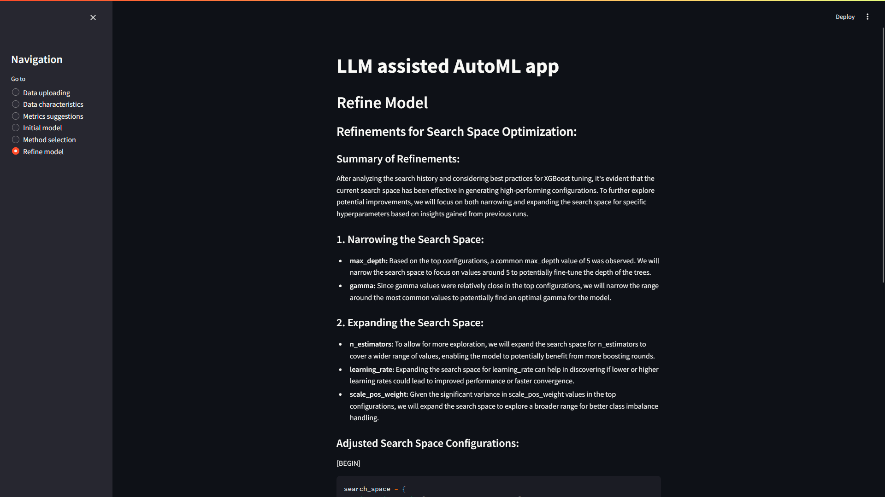
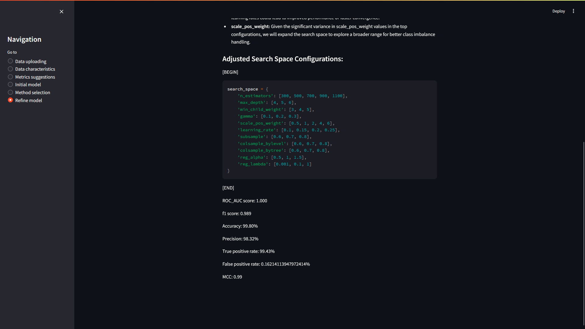

# LLM assisted AutoML App
> [!IMPORTANT]
> You will need to replace "YOUR API KEY HERE" by your actual openai api key (openai_api_key = '"YOUR API KEY HERE"' ligne 25 in app.py)

## Project description
This project aims to create a web app allowing none initiated people to create a suitable and fine tuned model for the dataset they provide.
The only two inputs the users have to do are :
- Uploading a dataset (make sure the target column is the last one)
- Describing what is important to know beforehand with their dataset (for example wether it is crucial or not to avoid false positive results...)
> [!WARNING]
> For now only classification tasks are available

## Functioning principle

## Execution example

